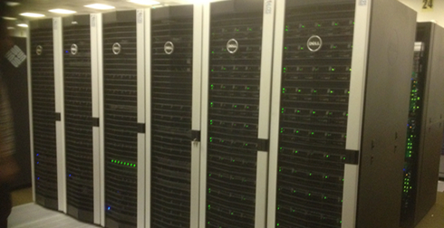

.. include:: /referenceinfo/imports/decommissioned/decom_watermark.rst
.. _iceberg:

Iceberg
=======

The Iceberg HPC cluster was retired in November 2019.  Key features:

- Approx. 3500 CPU cores (mixture of AMD, Intel Ivybridge and Intel Westmere over its lifetime)
- 260 TB Lustre filesystem
- Fast Infiniband interconnects between worker nodes and to/from storage nodes.
- 16 public GPUS (NVIDIA K40M and NVIDIA M2070 GPUs)
- Used the Sun of Grid Engine job scheduler / resource manager (as does the newer ShARC cluster)
- Scientific Linux 6 operating system

