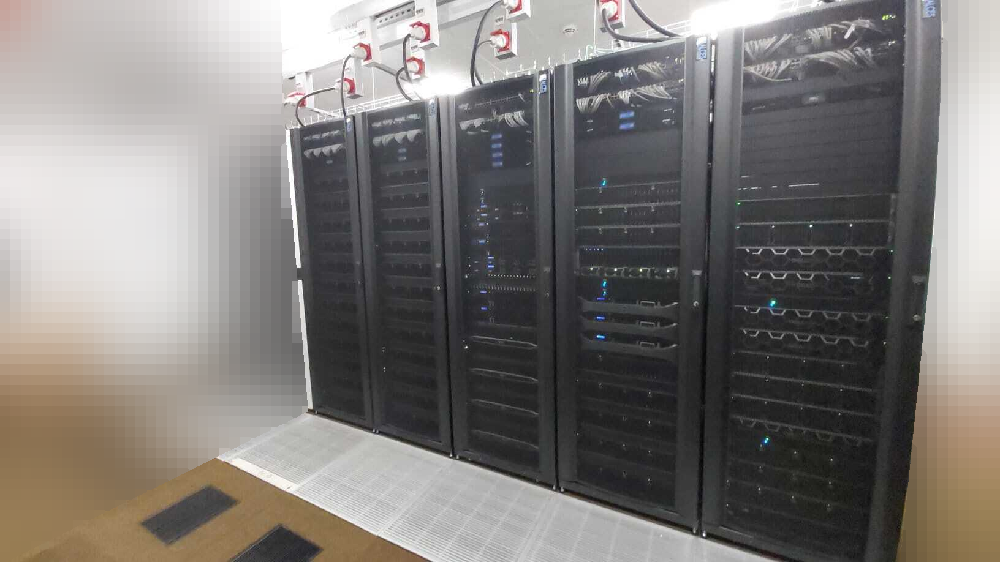
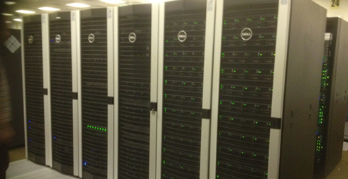

.. _decommissioned:

Decommissioned Clusters
========================

.. toctree::
  :maxdepth: 1
  :glob:

.. _sharc:

ShARC
-----

The ShARC HPC cluster was retired in November 2023. It was shipped to `Igor Sikorsky Kyiv Polytechnic Institute` in Kyiv, for it's second life.

Key features:

- 2024 CPU cores (mixture of Intel Haswell, Intel Broadwell and Intel Skylake-SP over its lifetime)
- 10 TB RAM (98 nodes with 64GB, 9 nodes with 256Gb, and 1 node with 384GB)
- 669 TB Lustre filesystem
- Fast OmniPath(100 GB/s) interconnects between worker nodes and to/from storage nodes.
- 16 public GPUS (NVIDIA Telsa K80)
- Used the Sun of Grid Engine job scheduler / resource manager
- CentOS 7.x operating system

--------------------------------------------------

.. _iceberg:

Iceberg
-------

The Iceberg HPC cluster was retired in November 2019. 

Key features:

- Approx. 3500 CPU cores (mixture of AMD, Intel Ivybridge and Intel Westmere over its lifetime)
- 260 TB Lustre filesystem
- Fast Infiniband interconnects between worker nodes and to/from storage nodes.
- 16 public GPUS (NVIDIA K40M and NVIDIA M2070 GPUs)
- Used the Sun of Grid Engine job scheduler / resource manager 
- Scientific Linux 6 operating system

