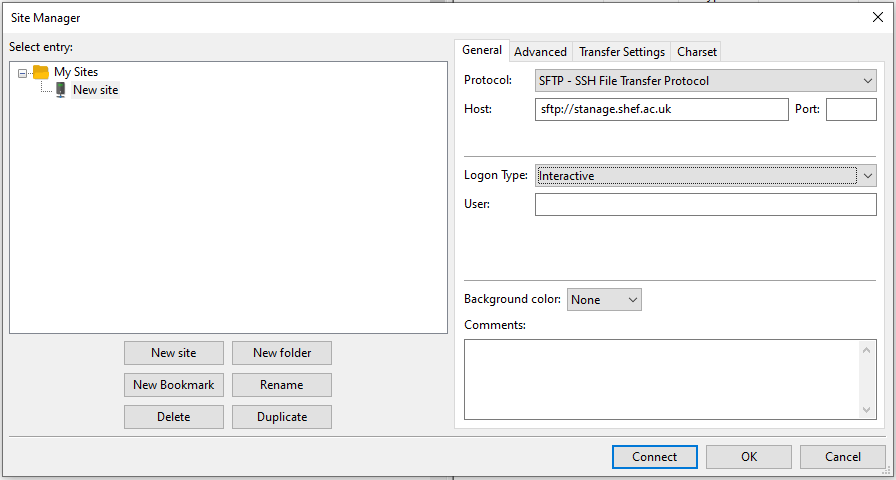

.. _transferring_files:

Transferring files 
==================

.. warning::

  As with all connections to the clusters, if you are not using a wired ethernet connection in a 
  University campus building then you will need to `turn on the VPN <https://www.sheffield.ac.uk/it-services/vpn>`_.

To transfer files to/from the clusters you can:

* Use a program that supports one or both of the **SCP** and **SFTP** protocols to copy/move files to/from your own machine 
  or from a remote machine to the cluster.
* Use a `Research Storage fileshare <https://www.sheffield.ac.uk/it-services/research-storage/>`_ as common storage directly 
  accessible from your own machine and from the clusters.
* Use a program like ``curl`` or ``wget`` to download files directly to the clusters.
* Use a :ref:`flight session <flight-desktop>` on Stanage or interactive session on Bessemer, to open a Firefox browser and interactively download directly to clusters. 

.. hint::

  :ref:`Downloading directly <download_direct_to_cluster>` **to the cluster may be 10x to 100x faster** than doing a transfer 
  from your local desktop or laptop (particularly if connecting remotely via VPN) as this will avoid using your local device's 
  internet connection which is likely a bottleneck. 
  If you are able, you should make :ref:`direct downloads <download_direct_to_cluster>` to the cluster.

---------

Transfers with SCP/SFTP
-----------------------

Secure copy protocol (SCP) is a protocol for securely transferring computer files between a local host and a 
remote host or between two remote hosts. It is based on the Secure Shell (SSH) protocol and the acronym typically 
refers to both the protocol and the command itself.

Secure File Transfer Protocol (SFTP) is also a file transfer protocol. It is based on the 
FTP protocol with included SSH security components.

.. hint::

  If you need to move large files (e.g. larger than a gigabyte) from one remote machine to the cluster you 
  should SSH in to the computer hosting the files and use scp or rsync to transfer over to the other directly as this will 
  usually be quicker and more reliable.

  If you cannot SSH into the remote machine, consider an alternative 
  :ref:`direct transfer method listed below <download_direct_to_cluster>`.

.. raw:: html

    

Using SCP in the terminal
^^^^^^^^^^^^^^^^^^^^^^^^^

If your local machine has a terminal and the ``scp``  (“secure copy”) command is available 
you can use it to make transfers of files or folders.

Where below substitute **CLUSTER_NAME** with stanage or bessemer
and **YOUR_USERNAME** with your cluster username. 

You should be prompted for your Duo MFA credentials after entering your password. Request a push notification or enter your passcode.

To upload, you transfer from your local machine to the remote cluster:

.. code-block:: shell

  scp /path/to/file.txt YOUR_USERNAME@CLUSTER_NAME.shef.ac.uk:/path/to/directory/

To download, you transfer from the remote cluster to your local machine:

.. code-block:: shell

  scp YOUR_USERNAME@CLUSTER_NAME.shef.ac.uk:/path/to/file.txt /path/to/directory/

To copy a whole directory, we add the ``-r`` flag, for “recursive”

.. code-block:: shell

  scp -r YOUR_USERNAME@CLUSTER_NAME.shef.ac.uk:/path/to/my_results /path/to/directory/

.. raw:: html

    

Using Filezilla
^^^^^^^^^^^^^^^^^^^^

FileZilla is a cross-platform client available for Windows, MacOS and Linux for downloading 
and uploading files to and from a remote computer.

Download and install the FileZilla **client** from https://filezilla-project.org. After installing and opening the program, 
there is a window with a file browser of your local system on the left hand side of the screen
and when you connected to a cluster, your cluster files will appear on the right hand side.

To connect to the cluster, we’ll just need make a **new site** and enter our credentials in the **General** tab:

.. caution::

  By default Filezilla will save profiles in plaintext on your machine. You must ensure you use a master password to 
  encrypt these credentials by changing the settings 
  `as shown in these instructions <https://filezillapro.com/docs/v3/advanced/master-password/>`_.

You can create a new site by selecting *file* from top menu bar then *site manager* which will open a dialog similar to:

|br|

After hitting the *new site* button you can enter your credentials in the general tab:

* **Host**: sftp://CLUSTER_NAME.shef.ac.uk (replace CLUSTER_NAME with stanage or bessemer)
* **User**: Your cluster username
* **Password**: Your cluster password (leave blank and fill this interactively if on a shared machine.)
* **Port**: (leave blank to use the default port)
* **Protocol**: sftp
* **Logon Type**: Interactive

In the **transfer settings** tab limit the number of simultaneous connections to 1.

Save these details as a profile and then connect. You should be prompted for your Duo MFA credentials. 
Request a push notification or enter your passcode.  You will now see your remote files appear on the 
right hand side of the screen. This process can be repeated to save a profile for each cluster.

You can drag-and-drop files between the left (local) and right (remote) sides of the screen to transfer files.

.. raw:: html

    

.. _rsync:

Using rsync
^^^^^^^^^^^^^^^^^^^^

As you become more familiar with transferring files, you may find that the ``scp`` is limited. The ``rsync`` utility provides 
advanced features for file transfer and is typically faster compared to both ``scp`` and ``sftp``. It is a utility for 
efficiently transferring and synchronizing files between storage locations including networked computers by comparing the 
modification times and sizes of files. The utility is particularly useful as it can also resume failed or partial file 
transfers by using the ``--append-verify`` flag.

Many users find ``rsync`` is especially useful for transferring large and/or many files as well as creating synced 
backup folders.

.. caution::

  It is easy to make mistakes with ``rsync`` and accidentally transfer files to the wrong location, sync in the wrong 
  direction or otherwise accidentally overwrite files. To help you avoid this, you can first use the ``--dry-run`` flag for 
  ``rsync`` to show you the changes it will make for a given command. 
  
.. _rsync_behaviour:

.. note:: 

      Be cautious when specifying paths with or without trailing slashes. 
      Ensure that you understand how ``rsync`` interprets these slashes to prevent unintended outcomes. 
      
      .. dropdown:: rsync Behaviour with Trailing Slashes
      
            **With Trailing Slash on Source Directory**:
      
            .. code-block::
            
                rsync -av /source/directory/ /destination/directory
      
            - When you use a trailing slash on the source directory it tells ``rsync`` to copy the **contents** of the source directory into the destination directory.
      
            **Without Trailing Slash on Source Directory**:
      
            .. code-block::
            
                    rsync -av /source/directory /destination/directory
      
            - When you don't use a trailing slash on the source directory it tells ``rsync`` to copy the **source directory itself** and its contents into the destination directory.
      
            **Trailing Slash on Destination Directory**:
      
            .. code-block::
            
                    rsync -av /source/directory/ /destination/directory/
      
            - When you use a trailing slash on the destination directory it tells ``rsync`` to copy the **source directory itself** and its contents into the destination directory.
      
            **Without Trailing Slash on Destination Directory**:
      
            .. code-block::
            
                    rsync -av /source/directory/ /destination/directory
      
            - When you don't use a trailing slash on the destination directory it tells ``rsync`` to copy the **contents** of the source directory into the destination directory.
      

The ``rsync`` syntax is very similar to ``scp``. To transfer to another computer with commonly used options, 
where below substitute **CLUSTER_NAME** with stanage or bessemer and **YOUR_USERNAME** with your cluster username.
You should be prompted for your Duo MFA credentials after entering your password. Request a push notification or 
enter your passcode:

.. code-block:: shell

  rsync -avzP /path/to/file.iso YOUR_USERNAME@CLUSTER_NAME.shef.ac.uk:/path/to/directory/

The ``a`` (archive) option preserves file timestamps and permissions among other things; 
the ``v`` (verbose) option gives verbose output to help monitor the transfer; 
the ``z`` (compression) option compresses the file during transit to reduce size and transfer time; 
and the ``P`` (partial/progress) option preserves partially transferred files in case of an interruption 
and also displays the progress of the transfer.

To recursively copy a directory, we can use the same options:

.. code-block:: shell

  rsync -avzP /path/to/isos/ YOUR_USERNAME@CLUSTER_NAME.shef.ac.uk:/path/to/directory/

This will copy the local directory and its contents under the specified directory on the remote system.
If the trailing slash is omitted on the destination path, a new directory corresponding to the transferred 
directory (isos in the example) will not be created, and the contents of the source directory will be copied 
directly into the destination directory.

As before with ``scp``, to download from the cluster rather than upload simply reverse the source and destination:

.. code-block:: shell

  rsync -avzP YOUR_USERNAME@CLUSTER_NAME.shef.ac.uk:/path/to/isos /path/to/directory/ 

---------

.. _download_direct_to_cluster:

How to download files directly to the cluster
---------------------------------------------

Downloading files directly to the cluster is usually the quickest and most efficient 
way of getting files onto the clusters. Using your home connection will be a significant 
speed bottleneck compared to large amounts of download bandwidth available on the clusters.
Directly downloading to the cluster avoids this bottleneck!

Using Firefox Browser
^^^^^^^^^^^^^^^^^^^^^

Firefox browser can be used on both Stanage and Bessemer. This will allow you to interactively navigate the web,
login to websites and download files as you would do locally.

.. tabs::

  .. group-tab:: Stanage

        Graphical desktop access to an interactive session can be achieved using 
        :ref:`Flight Desktop and TigerVNC<flight-desktop>` .
        Once you have loaded the GUI desktop, open a terminal at the bottom of the screen
        and enter the command ``firefox``, which will launch a browser.

  .. group-tab:: Bessemer

        On Bessemer a Firefox GUI can be loaded directly.  This can be achieved 
        by starting an interactive session with the :code:`srun --pty bash -i` command and then 
        opening ``firefox`` by running the same named command. For this to function correctly you 
        must ensure that X11/GUI forwarding is enabled when connecting with SSH.

.. raw:: html

    

Using wget / curl
^^^^^^^^^^^^^^^^^^^^

One of the most efficient ways to download files to the clusters is to use either the 
curl or wget commands to download directly.

The syntax for these commands is as below:

Downloading with wget
""""""""""""""""""""""

.. code-block:: shell

  wget https://software.github.io/program/files/myprogram.tar.gz

Downloading with curl
""""""""""""""""""""""

.. code-block:: shell

  curl -O https://software.github.io/program/files/myprogram.tar.gz

.. raw:: html

    

Using Git
^^^^^^^^^

The Git software and same named command can be used to download or synchronise a remote Git 
repository onto the clusters. This can be achieved by 
`setting up Git <https://git-scm.com/book/en/v2/Getting-Started-First-Time-Git-Setup>`_ 
and/or simply cloning the repository you desire.

For example, cloning the source of the ``make`` software:

.. code-block:: console
    :emphasize-lines: 1

    [user@login1 make-git]$ git clone https://git.savannah.gnu.org/git/make.git
    Cloning into 'make'...
    remote: Counting objects: 16331, done.
    remote: Compressing objects: 100% (3434/3434), done.
    remote: Total 16331 (delta 12822), reused 16331 (delta 12822)
    Receiving objects: 100% (16331/16331), 5.07 MiB | 2.79 MiB/s, done.
    Resolving deltas: 100% (12822/12822), done.

Git is installed on the clusters and can be used on any node and all 
`commands <https://blog.testproject.io/2021/03/22/git-commands-every-sdet-should-know/>`_ 
such as **push**, **pull** etc... are supported.

.. raw:: html

    

Using lftp
^^^^^^^^^^^^^^^^^^^^

.. hint::

  It is recommended that you use an alternative method than ``lftp`` if possible. Using 
  ``lftp`` in the command line interface should be a last resort as it is a little 
  difficult / confusing to use.

``lftp`` is a command-line program client for FTP, FTPS, FXP, HTTP, HTTPS, FISH, SFTP, 
BitTorrent, and FTP over HTTP proxy. 

If you need to **login** to an FTP server to 
make a direct download to a cluster, you can use the ``lftp`` client. 

Connecting with lftp
""""""""""""""""""""""

.. caution::

  Where possible please connect with the ftps protocol as this protects your username 
  and password from hackers performing man in the middle or sniffing attacks!

Connecting to an FTP server can be achieved as follows:

.. code-block:: shell

  lftp ftps://ftp.remotehost.com

When this connection is successful an ``lftp`` prompt will appear as follows:

.. code-block:: shell

  lftp ftp.remotehost.com:~>

At this stage you can now login after being prompted for your password 
as follows:

.. code-block:: shell

  lftp ftp.remotehost.com:~> login username
  Password:

At this stage directory listing and changing directory can be achieved using the 
``ls`` and ``cd`` commands. By default these commands run on the remote server. To run 
these commands on the local machine simply prefix each command with an ``!`` i.e.
``!ls`` and ``!cd``.

The ``get`` (download) and ``put`` (upload) commands can also be used.

Downloading with lftp
""""""""""""""""""""""

To download a file use the ``get`` command as follows:

.. code-block:: shell

  lftp username@ftp.remotehost.com/> get myfile.txt -o mydownloadedfile.txt

Uploading with lftp
""""""""""""""""""""""

To upload a file use the ``put`` command as follows:

.. code-block:: shell

  lftp username@ftp.remotehost.com/> put myfile.txt -o myuploadedfile.txt
