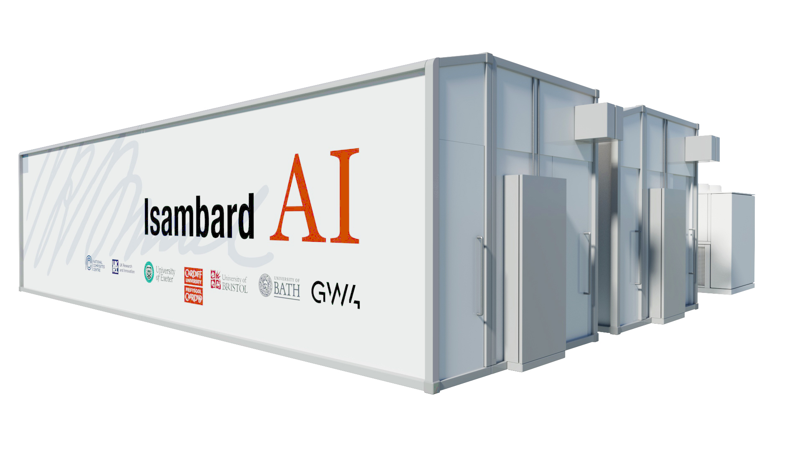
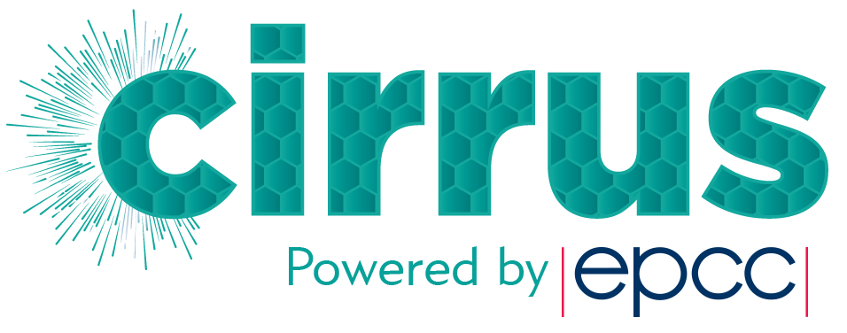

.. _other_uk_hpc_resources:

|hide-external-link-icons|

*****************************************
Access to External UK HPC Facilities
*****************************************

The United Kingdom has a number of HPC facilities external to the University of Sheffield
which will grant researchers HPC resources. These include Isambard-AI (the UK's first Tier-0 system),
national facilities (Tier-1) such as Archer 2 and regional systems (Tier-2) such as :ref:`BEDE <bede>`.

The University of Sheffield is a member of the :ref:`BEDE <bede>` regional system thus
registration for using resources on that system is straightforward, with a dedicated page
describing that system and its application processes listed below.

The Research and Innovation IT team in IT Services and the Research Software Engineering
(RSE) teams are supporting and coordinating applications, and sharing knowledge to increase
the success of applications. Not only will we provide technical input into applications,
but we will apply experience of other access calls to strengthen your application and ensure
it has the best chance of success.

We can also provide technical, collaborative support to projects once access to external
HPC systems has been granted, including but not limited to:

- Bede
- Isambard AI

IT Services and the RSE team have prior experience of offering such support to TUoS users
of the Bede and JADE2 HPC/GPU systems.

Further Tier 1 and Tier 2 systems are also listed below with a brief explanation of their
purpose along with links for further details.

-------

======================================================
University of Sheffield Directly Affliated HPC Systems
======================================================

Current:

.. toctree::
   :maxdepth: 1

   other-uk-hpc-resources/bede

Retired:

.. toctree::
   :maxdepth: 1

   other-uk-hpc-resources/jade2
   other-uk-hpc-resources/jade

-------

=======================
UK National HPC Systems
=======================

ARCHER2
-------

ARCHER2_, the UK national supercomputing service offers
a capability resource for running very large parallel jobs.
Based around an HPE Cray EX supercomputing system with an estimated peak performance of 28 PFLOP/s,
the
machine will have 5,848 compute nodes,
each with dual AMD EPYC Zen2 (Rome) 64 core CPUs at 2.2GHz,
giving 748,544 cores in total. 
The service includes a service desk staffed by HPC experts from EPCC with support from HPE Cray.
Access is free at point of use for academic researchers working in the EPSRC and NERC domains.
Users are also able to purchase access at a variety of rates.

Isambard AI
-----------

Isambard AI is one of the UK's AI Research Resource (AIRR) large-scale HPC/AI systems.
It is operated by the University of Bristol for UKRI/DSIT.

Specification: `Phase 1 of Isambard AI <Isambard_AI_Phase_1_>`_ comprises 40 compute nodes,
each of which contains 4 Nvidia Grace-Hopper (GH200) superchips.
Each node has 288 Grace CPU cores and 4 H100 GPUs.
There is 512 GB of CPU memory per node, and 384 GB of High Bandwidth (GPU) memory.
The nodes are connected using a Slingshot high performance network interconnect (4x 200 Gbps injection points per node).

From summer 2025, users will also be able to access Isambard-AI phase 2 through an early access call while the system is being tested,
which has an additional 5,280 Nvidia Grace Hopper (GH200) superchips.

Access to Isambard AI Phase 1 is via a `UKRI/DSIT call <AIRR_first_access_call_>`__.

Dawn
----

Dawn_ is one of the UK's AI Research Resource (AIRR) large-scale HPC/AI systems.
It is operated by the University of Cambridge for UKRI/DSIT.

Specification: Dawn consists of 256 Dell XE9640 server nodes.
Each server has 4 Intel Data Centre Max 1550 GPUs
(each GPU has 128 GB HBM RAM configured in a 4-way SMP mode with XE-LINK).
In total there are 1024 Intel GPUs.
Each server has 2 Gen 5 XEONs, and 1TB RAM and 4 HDR200 Infiniband links connected to a fully non-blocking fat tree.
There is 14TB of local NVMe storage on each server.
Dawn also has 2.8PB of NVMe flash storage.
This consists of 18 quad-connected HDR infiniband servers providing 1.8 TB/s of network bandwidth to 432 NVMe drives designed to match the network performance.
This High Performance storage layer will be tightly integrated with the scheduling software to support complex pipelines and AI workloads.
Dawn has also access to 5PB of HPC Lustre storage on spinning disks.
During the pilot phase 100 nodes will be available to users whilst development and performance work continues on the rest of the cluster.

Access to Dawn is via a `UKRI/DSIT call <AIRR_first_access_call_>`__.

===========================
EPSRC affliated HPC Systems
===========================

Cirrus at EPCC
----------------

`Cirrus at EPCC <https://www.cirrus.ac.uk/>`_ is one of the EPSRC Tier-2 HPC facilities.
The main resource is a 10,080 core SGI/HPE ICE XA system. Cirrus Phase II saw the addition
of 36 HPE Plainfield Blades each with two Intel Xeon processors and four NVIDIA v100 GPUs.
Free access is available to academic researchers working in the EPSRC domain and from
some UK universities; academic users from other domains and institutions can purchase
access.

.. raw:: html

    

Isambard at GW4
----------------

`Isambard at GW4 <https://gw4.ac.uk/isambard/>`_ is one of the EPSRC Tier-2 HPC
facilities. Isambard provides multiple advanced architectures within the same
system in order to enable evaluation and comparison across a diverse range of
hardware platforms. Free access is available to academic researchers working in
the EPSRC domain and from some UK universities; academic users from other domains
and institutions can purchase access.

.. raw:: html

    

Cambridge Service for Data Driven Discovery (CSD3)
--------------------------------------------------

`Cambridge Service for Data Driven Discovery (CSD3) <https://www.csd3.cam.ac.uk/>`_ is
one of the EPSRC Tier-2 HPC facilities. CSD3 is a multi-institution service
underpinned by an innovative, petascale, data-centric HPC platform, designed
specifically to drive data-intensive simulation and high-performance data analysis.
Free access is available to academic researchers working in the EPSRC domain and from
some UK universities; academic users from other domains and institutions can purchase
access.

.. raw:: html

    

Sulis at HPC Midlands+
------------------------

`Sulis at HPC Midlands+ <https://sulis.ac.uk/>`_ is a
Tier-2 HPC platform for ensemble computing workflows, realised through replicating
workstation-scale calculations over many inputs or models. Sulis delivers substantial
HPC capacity targeted at data-intensive, high-throughput workloads, based on modern
software deployment and containerisation technologies to enable scale up from workstation
to Tier-2 with minimal code modification. The platform is further supported by a developing
Research Software Engineering training effort which recognises non-traditional routes to
large-scale scientific research. Access to Sulis is available through the EPSRC Access to
HPC calls or via the HPC Midlands+ Consortium.

.. raw:: html

    

MMM Hub (Materials and Molecular Modelling Hub)
------------------------------------------------

`The MMM Hub (Materials and Molecular Modelling Hub) <https://mmmhub.ac.uk/>`_
was designed specifically for the materials and molecular modelling community, this Tier 2
supercomputing facility is available to HPC users all over the UK. The MMM Hub was established
in 2016 with a £4m EPSRC grant awarded to collaborators The Thomas Young Centre (TYC),
and the Science and Engineering South Consortium (SES). The MMM Hub is led by University
College London on behalf of the eight collaborative partners who sit within the TYC and SES:
Imperial, King’s, QMUL, Oxford, Southampton, Kent, Belfast and Cambridge.

.. raw:: html

    

NI-HPC
------

`The NI-HPC Centre <https://www.ni-hpc.ac.uk/>`_
is a UK Tier-2 National High Performance Computing (HPC) facility funded
by EPSRC and jointly managed by Queen's University Belfast (QUB) and Ulster University.
The focus is on introducing new aspects of HPC modelling for neurotechnology and
computational neuroscience, advanced chemistry, innovative drug delivery, precision medicine,
metabolomics and hydrogen safety. The cluster is named Kelvin2 and is comprised of 60x128core
AMD nodes, 4x2TB hi-memory nodes and 32xNVIDIA v100s. A fast track allocation process is
available for researchers wishing to try the facility.

-------

===========================
STFC affliated HPC Systems
===========================

Dirac
------

`DiRAC <https://www.dirac.ac.uk/>`_ is the STFC HPC facility for particle physics and
astronomy researchers. It is currently made up of five different systems with different
architectures. These range from an extreme scaling IBM BG/Q system, a large SGI/HPE UV SMP
system, and a number of Intel Xeon multicore HPC systems. Free access is available to
academic researchs working in the STFC domain; academic researchers from other domains
can purchase access.

.. _AIRR_first_access_call: https://engagementhub.ukri.org/ukri-infrastructure/airr-eoi/consultation/intro/
.. _ARCHER2: https://www.archer2.ac.uk/
.. _Dawn: https://www.hpc.cam.ac.uk/d-w-n
.. _Isambard_AI_Phase_1: https://docs.isambard.ac.uk/specs/#system-specifications-isambard-ai-phase-1
